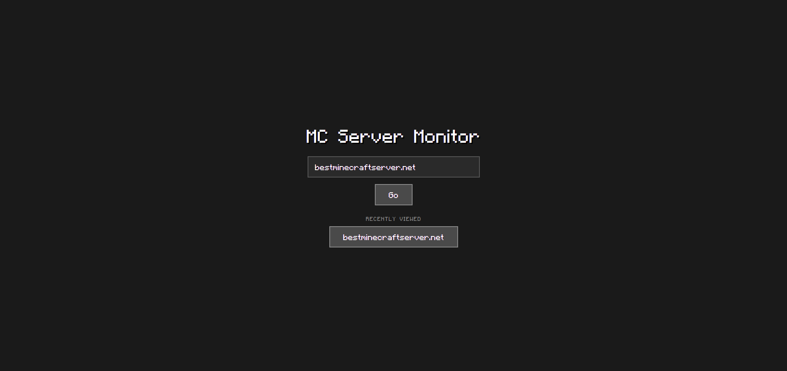
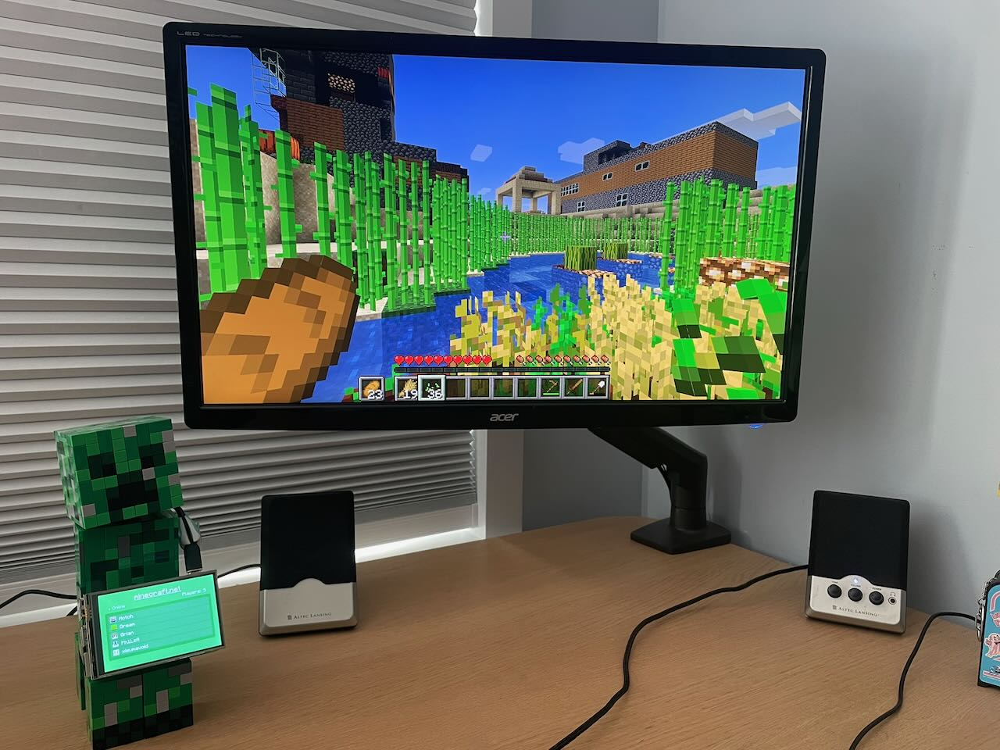
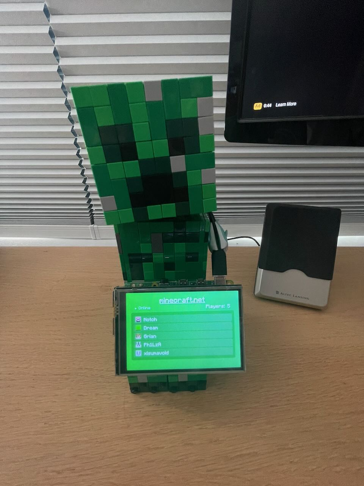

# MC MONITOR
Need info about your Minecraft server fast?
Easily check which of your friends are online with a clean graphical display using the MC Monitor  
[Try it out for yourself here](https://mcmonitor.onrender.com)

## Photos

  
   
  

## Features
Display whether server is online or offline  
If online, display player count and a list of the usernames and corresponding heads of 27 players  
Search bar for input of any public Minecraft server  
Save a list of 5 most recently viewed servers for easy repeatable access 

## Important info
For the monitor to work in its fullest form, "enable-query" must be set to true within the server.properties file of the server. If set to false, or certain server restrictions are in place, player info may not be displayed.

## Deploy to raspberry Pi
For a long term desktop display solution, the program can be ran as a server on a raspberry pi and hooked up to its own monitor  
Example usage:

  
   
  

To deploy, simply clone the repo and run this command from within the main directory  
PI_IP: replace with the IP address of your raspberry pi  
PI_USERNAME: replace with the username you chose when installing the raspberry pi OS  
SERVER_IP: replace with the IP address of the server you intend to monitor  

`ansible-playbook deployment/playbook.yaml -i "PI_IP," --user PI_USERNAME -e "server_address=SERVER_IP"`
